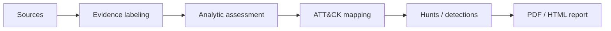

# CTI

Evidence-labeled cyber threat intelligence reports designed to become hunts, detections, pivots, and defensible assessments.


## Demo

Add screenshots of one HTML report, the evidence-label rubric, and the template directory.

## What This Is For

This repository is for CTI analysts, SOC leads, and detection engineers who need structured threat reports with explicit confidence discipline. Each report should make clear what is observed, reported, assessed, or claimed.

## What It Produces

| Output | Use |
|---|---|
| PDF report | Formal reading and sharing |
| HTML report | Web review |
| Evidence labels | Claim discipline |
| Actor notes | Research continuity |
| Templates | Repeatable CTI production |

## Reports

| Report | Format | Evidence model | Assessment confidence summary |
|---|---|---|---|
| Handala / Void Manticore | PDF + HTML | Observed / Reported / Assessed / Claimed | [user: confirm summary] |
| Sandworm / APT44 | PDF + HTML | Observed / Reported / Assessed / Claimed | [user: confirm summary] |
| MuddyWater / Seedworm | PDF + HTML | Observed / Reported / Assessed / Claimed | [user: confirm summary] |

## Quick Start

```bash
git clone https://github.com/anpa1200/CTI.git
cd CTI
find . -maxdepth 3 -type f | sort
```

## How It Works



## Coverage

| Area | Coverage |
|---|---|
| Actors | Handala / Void Manticore, Sandworm / APT44, MuddyWater / Seedworm |
| Labels | Observed, Reported, Assessed, Claimed |
| Outputs | PDF, HTML, templates |
| Use case | CTI, SOC handoff, detection planning |

## Related Sites And Articles

- Israel CTI knowledge base: https://1200km.com/israel-government-threat-actors-cti/
- CTI Analyst Field Manual: https://1200km.com/cti-analyst-field-manual/
- Attribution Methodology: https://medium.com/@1200km/attribution-methodology-how-to-build-defend-and-challenge-a-threat-actor-attribution-071066437ced
- Infrastructure Pivoting: https://infosecwriteups.com/infrastructure-pivoting-how-cti-analysts-expand-from-a-single-ioc-to-a-full-attacker-network
- ATT&CK as a Working Tool: https://medium.com/@1200km/att-ck-as-a-working-tool-theory-and-hands-on-practical-usage-d63835c9f101

## How To Cite

Use the report title, repository URL, commit hash, and access date. See `CITATION.cff`.

## Research Charter

See `RESEARCH-CHARTER.md`.

## Limitations And Honesty

Public-source CTI is bounded by available reporting. Reports should not overstate attribution beyond evidence quality.

## License

CC BY 4.0 recommended for reports and prose.

## Security Policy

See `SECURITY.md`.

## 1200km Ecosystem

This project is part of the 1200km security research ecosystem. Use [AdversaryGraph](https://1200km.com/adversarygraph/) for CTI-to-detection workflows, ATT&CK/ATLAS mapping, actor relevance, IOC enrichment, and analyst-ready reporting.

- [AdversaryGraph project hub](https://1200km.com/adversarygraph/)
- [AdversaryGraph documentation](https://1200km.com/adversarygraph-docs/)
- [Live ATT&CK/ATLAS workspace](https://1200km.com/threat-matrix/)
- [1200km security research ecosystem](https://1200km.com/)
